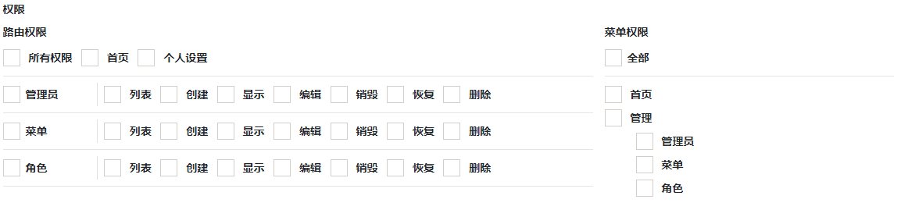

# authorize extension for laravel-admin 2.x

## 预览图
> 如果无法显示预览图，请搜“GitHub无法显示图片”解决


> 在2.0正式版发布之前，请使用2.0的最新开发版

```shell
# 安装2.0版本
composer require pucoder/laravel-admin:2.*
```

## Installation

```shell
composer require pucoder/authorization
```

Publish resources：

```shell script
php artisan vendor:publish --provider="Encore\Authorize\AuthorizeServiceProvider"
```

Initialization data

```php
php artisan authorize:init
```

> `超级管理员` 拥有所有权限，并且所有的菜单对其可见。


打开`http://localhost/admin/admin_roles`管理角色

在用户模块`http://localhost/admin/admin_users`可以给用户添加角色。

## 用法

### 设置路由别名（非常重要，非常重要，非常重要）

在`app/Admin/routes.php`中，给路由设置别名

```php
// 将会生成 `首页` 路由权限
$router->get('/', 'HomeController@index')->name('home');
// resource资源路由，将自动生成`列表`、`新增`、`编辑`、`删除`路由权限，其中新增包含（`创建`、`保存`），编辑包含（`编辑`、`更新`）
$router->resource('users', 'UserController')->names('users');
// 如果希望多个路由在一个分组下面，可以使用下面的方法，会生成恢复权限
$router->post('users/{user}/restore', 'UserController@restore')->name('users.restore');
```

### Action通过路由访问控制（推荐使用方式二）

如果你使用了laravel-admin的actions，并希望进行访问控制，这里以用户的 `恢复操作` 为例

- 路由已创建

- 创建action `app/Admin/Actions/Users/Replicate.php`
  ```php
  namespace App\Admin\Actions\Users;
  
  use Encore\Admin\Actions\Response;
  use Encore\Admin\Actions\RowAction;
  use Illuminate\Database\Eloquent\Model;
  use Illuminate\Support\Facades\DB;
  
  class Replicate extends RowAction
  {
      /**
       * @var string
       */
      protected $method = 'POST';
  
      /**
       * @return array|null|string
       */
      public function name()
      {
          return '恢复';
      }
      
      //============方式二需要用到的方法=================
      /**
       * @param Model $model
       *
       * @return Response
       */
      public function handle(Model $model)
      {
          try {
              DB::transaction(function () use ($model) {
                  $model->restore();
              });
          } catch (\Exception $exception) {
              return $this->response()->error('恢复失败！: {$exception->getMessage()}');
          }
  
          return $this->response()->success('恢复成功！')->refresh();
      }
      //============方式二需要用到的方法=================
      
      /**
       * @return string
       */
      public function getHandleUrl()
      {
          return '';
      }
  
      /**
       * @return void
       */
      public function dialog()
      {
          $this->question('确认恢复？');
      }
  
      /**
       * @return string
       */
      public function render()
      {
          // 这里url的属性值就是【用户恢复】的路由路径
          $this->attribute('url', $this->parent->resource().'/'.$this->getKey().'/restore');
  
          return parent::render();
      }
  }
  ```

- 创建方法
  ```php
  
  use Encore\Admin\Http\Controllers\HandleController;
  
  class UserController extends AdminController
  {
      public function restore($id)
      {
          //方式一
          //$model = User::withTrashed()->find($id);

          //if ($model->restore()) {
          //    abort(200, '恢复成功！');//这里的返回信息目前laravel-admin不够完善
          //}

          //abort(500, '恢复失败！');
  
          //方式二
          return app(HandleController::class)->handleAction(request());
      }
  }
  ```

如果出现英文，请添加对应本地翻译即可

### 关于Switch开关权限

由于laravel-admin本身的switch操作无法判断权限

这里提供另外一种action方式实现权限控制，请参考 [这里](https://laravel-admin.org/docs/zh/2.x/model-table-column-display#列操作)
